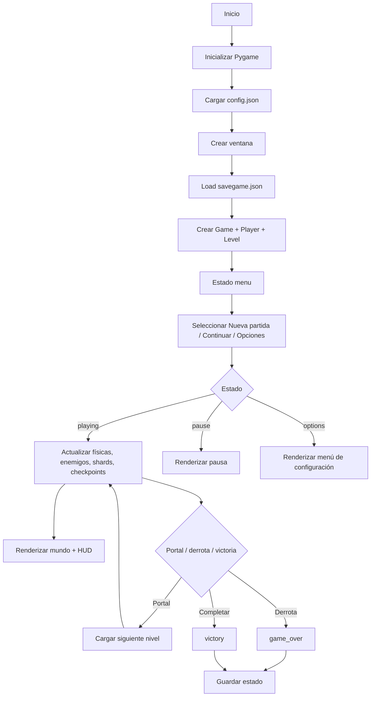

# Arquitectura de Nightfall Gargoyle

## 1. Resumen Ejecutivo

Nightfall Gargoyle es un juego de plataformas 2D desarrollado en Python con Pygame. Su arquitectura es un diseño compacto, orientado a una sola aplicación ejecutable, con una separación clara entre:

- lógica del juego,
- definición de niveles,
- configuración del entorno,
- persistencia de estado,
- presentación gráfica,
- pruebas automatizadas.

La aplicación no sigue un patrón de microservicios ni una separación puramente por capas tipo MVC, sino que se apoya en una arquitectura de dominio minimalista para un videojuego de una sola ventana, en la que el núcleo principal está concentrado en `nightfall_gargoyle/main.py` y el resto de módulos aportan datos y servicios cooperativos.

El diseño actual prioriza:

- rapidez de desarrollo,
- portabilidad entre Windows, Linux y macOS,
- ausencia de assets externos,
- guardado de progreso persistente,
- fácil extensión con nuevos niveles, enemigos y reglas.

---

## 2. Objetivos del Sistema

### 2.1 Objetivos funcionales

- Explorar niveles 2D con plataformas, picos, enemigos y portales.
- Mover al personaje principal con controles de plataforma clásica.
- Ejecutar ataque cuerpo a cuerpo y doble salto.
- Recolectar fragmentos lunares para abrir el acceso al siguiente nivel.
- Activar checkpoints y conservar el progreso.
- Guardar/cargar la partida desde JSON en el directorio de datos del usuario.
- Ajustar resolución y modo de pantalla completa.
- Soportar un menú principal, pausa, game over y victoria.

### 2.2 Objetivos no funcionales

- Multiplataforma nativa con Python y Pygame.
- Rendimiento suficiente para 60 FPS en un juego de 2D sin usar gráficos pesados.
- Persistencia robusta frente a archivos faltantes o corruptos.
- Código legible y fácil de modificar por una sola persona o equipo pequeño.
- Instalación simple vía `pip install -e .` y entry point del paquete.

---

## 3. Contexto y alcance

El proyecto tiene un alcance claramente definido como juego completo de una sola experiencia jugable con dos niveles. No está diseñado como un motor generalista ni como una infraestructura de varios módulos independientes; es una entrega enfocada en un juego concreto.

El sistema interactúa con:

- usuario final vía teclado y ventana de Pygame,
- sistema operativo para almacenamiento y resolución,
- archivos JSON para configuraciones y guardado,
- entorno Python y biblioteca Pygame.

No tiene dependencias externas de bases de datos, servicios web ni APIs externas.

---

## 4. Visión de Arquitectura

### 4.1 Estilo arquitectónico dominante

Se puede describir como una arquitectura modular monolítica de juego:

- un único proceso principal,
- con entidades y datos de dominio claramente separadas,
- sin capa de servicio distribuida,
- con actualización de estado a tiempo real en un bucle principal.

### 4.2 Principios de diseño aplicados

1. Simplicidad sobre abstracción.
2. Datos explícitos, no ocultos.
3. Estado centralizado en un objeto `Game`.
4. Módulos con responsabilidad única.
5. Persistencia tolerante a fallos.
6. Renderizado procedural sin assets externos.

---

## 5. Stack tecnológico

| Capa          | Tecnología     | Uso principal                                 |
| ------------- | -------------- | --------------------------------------------- |
| Lenguaje      | Python 3.10+   | Lógica del juego, sistema y persistencia      |
| Motor gráfico | Pygame 2.5+    | Ventana, eventos, renderizado, audio y timing |
| Persistencia  | JSON + pathlib | Guardado de partida y configuración           |
| Empaquetado   | setuptools     | Distribución y entry point                    |
| Pruebas       | unittest       | Validación de serialización y round-trip      |

### Dependencias relevantes

- `pygame` es la única dependencia funcional real.
- `setuptools` se usa para construir el paquete y exponer el comando `nightfall-gargoyle`.

---

## 6. Estructura del proyecto

```text
nightfall-gargoyle/
├── ARCHITECTURE.md
├── README.md
├── pyproject.toml
├── run_game.py
├── nightfall_gargoyle/
│   ├── __init__.py
│   ├── levels.py
│   ├── main.py
│   ├── persistence.py
│   └── settings.py
├── tests/
│   └── test_persistence.py
└── nightfall_gargoyle.egg-info/
```

### 6.1 Módulos y responsabilidad

#### `nightfall_gargoyle/main.py`

Es el núcleo ejecutable del juego. Contiene:

- el bucle principal de render/update,
- la gestión de estados,
- la lógica de controles,
- actualización de entidades,
- renderizado del HUD y del mundo,
- reglas de progresión.

Es el módulo más grande y el que centraliza la mayor parte del comportamiento del sistema.

#### `nightfall_gargoyle/levels.py`

Define el contenido de cada nivel usando dataclasses inmutables:

- `LevelData`
- `RectDef`, `EnemyDef`, `ShardDef`, `CheckpointDef`
- `LEVELS`

Este módulo sirve como fuente de configuración del mundo, evitando hardcode disperso.

#### `nightfall_gargoyle/settings.py`

Gestiona:

- nombre de la aplicación,
- dimensiones lógicas del juego,
- resolución base y presets,
- ubicación de datos del usuario,
- `GameConfig`,
- carga/guardado de `config.json`.

#### `nightfall_gargoyle/persistence.py`

Agrupa la persistencia del progreso:

- `SaveState`
- `new_save`, `load_save`, `write_save`, `reset_save`
- validación de esquemas y sanitización de datos.

#### `tests/test_persistence.py`

Verifica serialización y carga del guardado y la configuración. Es la base de validación de integración para la capa de persistencia.

---

## 7. Modelo de Dominio y Entidades

### 7.1 Entidades principales

#### `Player`

Representa al protagonista.

Atributos clave:

- posición (`pos`) y rectángulo (`rect`)
- velocidad vertical y horizontal
- salud, vidas, dirección de mirada
- detección de suelo y doble salto
- temporizadores de ataque e invulnerabilidad

Responsabilidades:

- actualizar física del movimiento,
- aplicar gravedad,
- detectar colisiones con plataformas,
- ejecutar ataque,
- recibir daño.

#### `Enemy`

Representa enemigos patrullando en un rango horizontal.

Responsabilidades:

- detectar rango de movimiento,
- cambiar de dirección al tocar borde,
- atacar o ser derrotados por el jugador.

#### `Shard`

Es un fragmento coleccionable.

Responsabilidades:

- dibujarse con animación flotante,
- ser recogido por el jugador,
- aumentar el contador de progreso y el total disponible.

#### `Checkpoint`

Marca un punto de guardado por nivel.

Responsabilidades:

- registrar un spawn del jugador,
- activarse al contacto,
- persistir el estado del progreso del jugador.

#### `Gate`

Representa el portal de salida del nivel.

Responsabilidades:

- comprobar si se han cumplido los fragmentos necesarios,
- habilitar la apertura del portal,
- avanzar al siguiente nivel.

### 7.2 Objetos de soporte

- `Toast`: mensajes efímeros sobre la pantalla.
- `Game`: orquestador de todo el estado del juego.
- `LevelData`: definición declarativa del mapa del nivel.
- `GameConfig`: configuración persistente del usuario.
- `SaveState`: contenido persistente del progreso.

---

## 8. Modelo de datos

### 8.1 `GameConfig`

Persistencia de la configuración del usuario:

- `width`, `height`
- `fullscreen`
- `master_volume`
- `vsync`

Se serializa a JSON y se guarda en `config.json`.

### 8.2 `SaveState`

Estado de la partida:

- `schema_version`
- `profile_name`
- `current_level`
- `checkpoint`
- `health`
- `lives`
- `collected_shards`
- `defeated_enemies`
- `reached_checkpoints`
- `unlocked_levels`
- `play_time_seconds`
- `last_saved`

Se guarda en `savegame.json`.

### 8.3 `LevelData`

Cada nivel declara:

- identificador único,
- nombre y subtítulo,
- dimensión del nivel,
- spawn inicial,
- fragmentos requeridos,
- plataformas,
- peligros,
- shards,
- enemigos,
- checkpoints,
- puerta de salida.

Esto permite que el contenido de los niveles sea declarativo y no dependiente de lógica imperativa compleja.

---

## 9. Flujo de ejecución

### 9.1 Inicio

Cuando se ejecuta la aplicación:

1. Se inicializa Pygame.
2. Se carga la configuración del usuario.
3. Se crea la ventana según `GameConfig`.
4. Se prepara la superficie lógica de juego.
5. Se cargan datos de estado de guardado.
6. Se inicializa el primer nivel y el jugador.
7. Se entra al estado `menu` o `playing` según la elección del usuario.

### 9.2 Bucle principal

El ciclo sigue esta secuencia:

1. medir `dt` con el reloj del juego,
2. procesar eventos,
3. actualizar estado del juego,
4. renderizar mundo y UI,
5. presentar en pantalla.

### 9.3 Estados del juego

La clase `Game` usa un conjunto de estados:

- `menu`
- `options`
- `playing`
- `pause`
- `game_over`
- `victory`

Cada estado maneja eventos y render distintos. Esto evita mezclar lógica de navegación con lógica de juego activo.

---

## 10. Diagrama de flujo principal



---

## 11. Gestión de eventos y input

El flujo de input se basa en dos mecanismos:

- `pygame.event.get()` para eventos discretos (teclas, resize, quit)
- `pygame.key.get_pressed()` para lectura continua del estado del teclado.

Esto permite manejar:

- salto con pulsación instantánea,
- ataques con acción discreta,
- movimiento continuo en horizontal,
- navegación por menús usando flechas y enter.

El método `handle_event` enruta cada evento según el estado actual (`menu`, `options`, `playing`, etc.).

---

## 12. Lógica de juego y física

### 12.1 Movimiento del jugador

La física del personaje está implementada en la clase `Player` con una aproximación sencilla de plataforma 2D:

- aceleración en horizontal,
- fricción,
- gravedad constante,
- salto y doble salto,
- detección de colisiones por eje X e Y,
- integración incremental de posición/velocidad.

El método principal es `update(...)`, que recibe:

- `dt` (delta de tiempo),
- estado del teclado,
- salto presionado,
- ataque presionado,
- plataformas del nivel.

### 12.2 Detección de colisiones

La resolución de colisiones se realiza con `pygame.Rect` y dos fases:

1. movimiento horizontal,
2. movimiento vertical.

Esto minimiza errores de penetración y permite una respuesta consistente a plataformas.

### 12.3 Sistemas interactivos del nivel

- `Enemy`: patrulla, puede ser derrotado o dañar al jugador.
- `Shard`: recoger para completar el objetivo del nivel.
- `Checkpoint`: restablece posición de respawn y persiste progreso.
- `Gate`: abre al cumplir requisitos del nivel.
- `Hazards`: picos y elementos letales.

---

## 13. Render y presentación

El juego utiliza un render pipeline propio y procedural:

- superficie lógica `self.surface` con resolución base 960×540,
- mundo dibujado sobre la superficie lógica,
- escalado a la ventana real en `present()`.

La intención es mantener un viewport consistente y un proceso de render más controlado que depender de assets preparados.

### 13.1 Capas visuales

Se dibujan varias capas:

- fondo degradado con luna,
- siluetas de montañas/ruinas,
- plataformas interactivas,
- peligros,
- collectibles,
- checkpoints,
- portal,
- enemigos,
- jugador,
- HUD.

### 13.2 UI

La interfaz se dibuja en la misma superficie lógica para un control más uniforme:

- menú principal,
- opciones,
- pausa,
- pantalla de fin de partida,
- victoria,
- toasts de mensajes,
- HUD con vidas, salud y fragmentos.

---

## 14. Persistencia y estado de usuario

### 14.1 Ubicación de datos

La carpeta de datos se determina en `settings.py` según el sistema operativo:

- Linux: `~/.local/share/nightfall_gargoyle/`
- Windows: `%APPDATA%\nightfall_gargoyle\`
- macOS: `~/Library/Application Support/nightfall_gargoyle/`

También existe una variable de entorno `NIGHTFALL_GARGOYLE_HOME` para sobreescribir la ruta en entornos portables o de desarrollo.

### 14.2 Guardado

El sistema usa JSON por simplicidad y fiabilidad. La serialización es directa gracias a `asdict()` sobre dataclasses.

#### `savegame.json`

Contiene el progreso real de la partida.

#### `config.json`

Contiene configuración de ventana y volumen.

### 14.3 Robustez de persistencia

El código de carga sanitiza los valores no válidos:

- usa valores por defecto si el archivo no existe,
- convierte tipos incompatibles a valores seguros,
- limita rangos de salud, volumen y coordenadas,
- devuelve `None` o valores por defecto si el JSON está corrupto.

Esto hace que el sistema sea tolerante a archivos incompletos o manualmente modificados.

---

## 15. Gestión del progreso del juego

### 15.1 Reglas principales

- El nivel actual se persiste con `current_level`.
- El checkpoint activo se guarda como una posición `(x, y)`.
- Los fragmentos recogidos se acumulan en una lista por nivel.
- Los enemigos derrotados se guardan por ID.
- Los checkpoints activados se guardan por ID.
- El portal se habilita solo si se recogen suficientes fragmentos del nivel actual.

### 15.2 Transición entre niveles

Cuando el jugador alcanza la puerta de salida:

1. se compara el número de fragmentos del nivel actual con `shards_required`,
2. si falta alguno, se muestra un toast de ayuda,
3. si se cumple, se activa el siguiente nivel,
4. se actualiza `current_level` y `unlocked_levels`,
5. se guarda en disco,
6. se usa `load_level(...)` para regenerar entidades y respawn.

---

## 16. Patrones de diseño observables

Aunque no se trata de una arquitectura formal de capas, el proyecto ya refleja varios patrones útiles:

### 16.1 Patrón de entidad + sistema

- entidades: `Player`, `Enemy`, `Shard`, `Checkpoint`, `Gate`
- lógica del sistema: `update_*`, `collect_shards`, `update_hazards`, `update_gate`

### 16.2 Patrón de dataclass como modelo de dominio

- `LevelData`
- `GameConfig`
- `SaveState`

Se usan para definir modelos con estructura clara, serializable y legible.

### 16.3 Patrón de estado de máquina

El flujo de UI y juego se expresa mediante `self.state` en `Game`.

### 16.4 Patrón de consulta/actualización por frame

Cada frame se hace:

- procesar input,
- actualizar entidades,
- renderizar.

---

## 17. Mejores atributos de calidad

### 17.1 Portabilidad

El proyecto está pensado para ejecutarse en distintos sistemas operativos sin cambios de código. La clave está en `settings.py` y en la abstracción de rutas.

### 17.2 Mantenibilidad

El contenido del juego está centralizado en dataclasses y el comportamiento en `Game`. Esto facilita ampliación sin dispersar lógica por toda la base.

### 17.3 Tolerancia a errores

La persistencia de JSON limpia y cornfía valores inválidos. La aplicación no cae por un archivo corrupto ni por una configuración incompleta.

### 17.4 Rendimiento

La lógica se ejecuta en un bucle simple y el mundo usa rectángulos y primitivas 2D para evitar carga de assets y problemas de rendimiento.

---

## 18. Riesgos y deuda técnica

### 18.1 Riesgos actuales

- El núcleo del juego está muy concentrado en `main.py`.
- La lógica de gameplay y la presentación están fuertemente acopladas.
- La escala del proyecto no justifica aún una separación estricta por capas, pero sí es un punto de crecimiento.
- La validación actual cubre la persistencia, pero no la lógica de niveles ni la mecánica de combate.

### 18.2 Deuda técnica asumible

- falta de tests para gameplay completo,
- falta de separación de sistemas por archivos (`rendering.py`, `game_logic.py`, `entities.py`),
- algunos métodos largos en `Game`,
- la lógica de estado está en una sola clase.

---

## 19. Recomendaciones de evolución

### 19.1 Fase 1: modularización ligera

Separar responsabilidades de `main.py` en:

- `entities.py`
- `systems.py`
- `render.py`
- `state.py`
- `game.py`

Esto mejoraría legibilidad sin cambiar la arquitectura general.

### 19.2 Fase 2: pruebas de lógica de juego

Añadir pruebas unitarias para:

- salud y daño,
- recolección de shard,
- activación de checkpoints,
- desbloqueo de portal,
- avance de nivel.

### 19.3 Fase 3: datos del contenido del juego

Mover contenido de niveles a archivos JSON/YAML externos, dejando una base de datos estructurada del contenido del juego.

### 19.4 Fase 4: soporte más avanzado

- más niveles,
- sistema de audio,
- menu con más opciones,
- guardado por perfil,
- particulas, efectos y entidades más complejas.

---

## 20. Conclusión

Nightfall Gargoyle tiene una arquitectura clara y consistente con un juego de pequeña escala: un monolito modular controlado por una clase `Game`, datos declarativos para niveles y configuración, almacenamiento JSON para persistencia y un sistema de renderizado procedural basado en Pygame.

Su mayor fortaleza es la sencillez operativa: es fácil de ejecutar, depurar, ampliar y mantener. Su mayor limitación es la concentración de lógica en un único módulo, una deuda técnica normal en prototipos y proyectos de juego pequeños que aún no requieren una separación formal más profunda.

En términos arquitectónicos, el proyecto es un ejemplo sólido de diseño de videojuego compacto, centrado en el gameplay y la experiencia de usuario, con una base técnica suficientemente limpia para crecer sin necesidad de reescribirla desde cero.

---

## 21. Resumen corto para la documentación del equipo

- Tipo de arquitectura: monolítica modular de videojuego.
- Motor: Pygame.
- Persistencia: JSON.
- Estado principal: `Game` con máquina de estados.
- Módulos clave: `main`, `levels`, `settings`, `persistence`.
- Principio: gameplay directo, datos declarativos y ejecución en un solo proceso.
